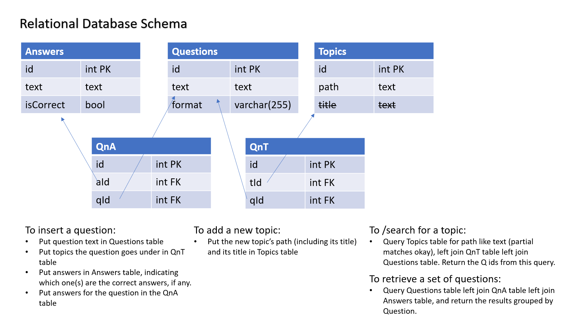
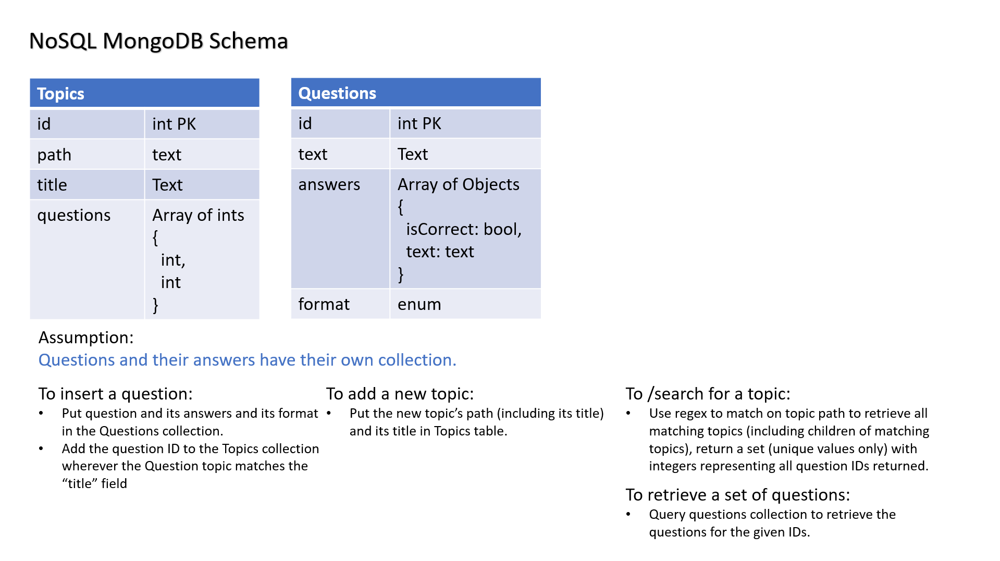

# Pencil - Backend

## Author: Dina Ayoub

## Links

- Heroku deployment:
- Example requests to the API
  - GET https://dina-pencil-backend.herokuapp.com/search?q=Cell%20Structure%20and%20Organisation
  - GET https://dina-pencil-backend.herokuapp.com/search?q=State,%20in%20simple%20terms,%20the%20relationship%20between%20cell%20function%20and%20cell%20structure%20for%20the%20following:

- [Requirements](https://docs.google.com/document/d/1qpvi7JrHxaTUItgOC-WMRw9ofK566xQYVt0QF4-CXh8/edit#)

## Setup

### `.env`

- `PORT` - Port number of your choosing for the server to run on. 
- `MONGOOSE_URI` - the uri to your mongo db including username and password

### How to run the server

- `npm start`

## API Usage

- GET /search
  - Parameters
    - q=`<topic>`
  - Results:
    - array of question numbers

## Tests

### How to run the tests

- `npm test`

### Test cases

- [] 
- [] 
- [] 
- [] 
- [] 
- [] 

### Coverage

- x% code coverage

## Domain Modeling

### Relational Database

If we were to implement this as a relational database, which the data lends itself well to, this is what it might look like

### No SQL Database

If we are to implement this as a Mongo DB (or any no SQL database), this is what it might look like - optimizing for search queries and assuming we must have a separate "questions" collection. Optimally, though, if we have control over the format of all the data and not just the topics / question numbers, then we might want to place the topics into the questions table as well and as an array of paths that we can use a regex to narrow down and retrieve the whole set of questions and answers at once instead of retrieving only the question numbers as per the exercise.
